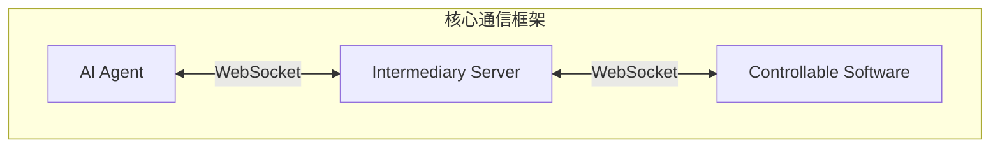

# AI Agent Controls Software Protocol

> 一个用于实现 AI 代理（Agent）与外部软件进行通信和控制的协议框架的最小化概念验证（PoC）项目。

本项目定义并实现了一套基于 WebSocket 和结构化 JSON 消息的通信协议，旨在创建一个通用框架，使 AI 代理能够理解软件的当前状态并对其进行操作，从而自主完成复杂任务。

## 核心理念

框架的核心思想是将 **决策（AI 代理）** 与 **执行（可控软件）** 完全解耦。AI 代理无需了解软件的内部实现细节，它仅通过一套标准化的“能力（Capabilities）”描述来感知软件的状态，并通过发送标准化的“行动指令（Action Plan）”来控制软件。

这种设计使得任何遵循此协议的软件或服务，都可以被接入到 AI 代理的控制体系中。

## 框架架构

本框架采用星型架构，由三个核心组件构成，通过一个中心化的中介服务器进行通信。



1.  **AI 代理 (AI Agent)**: 系统的“大脑”，负责接收用户任务，通过 LLM 理解任务并结合软件的当前能力，制定出分步行动计划。
2.  **中介服务器 (Intermediary Server)**: 一个轻量级的 WebSocket 消息路由器，负责管理连接和在 AI 代理与软件之间转发消息。
3.  **可控软件 (Controllable Software)**: 任何实现了本协议的应用程序后端。它负责将自身状态描述为“能力”，执行来自 AI 的指令，并反馈执行后的新状态。

## 主要特性

* **松耦合架构**: 三大核心组件相互独立，可独立开发、部署和扩展。
* **协议驱动**: 组件间的交互完全依赖于预定义的消息格式，保证了通信的规范性。
* **LLM 驱动决策**: AI 代理的核心逻辑由大语言模型驱动，使其具备强大的泛化和推理能力来应对复杂任务。
* **状态抽象化**: 软件通过 `Capabilities` 对象来暴露其功能和状态，这是一种标准化的“UI描述语言”，屏蔽了底层实现。
* **高扩展性**: 可以轻松集成新的可控软件，只需让新软件实现协议的客户端逻辑即可。

## 快速开始

### 1. 环境准备

* Python 3.8+
* pip 包管理器

### 2. 安装依赖

在项目根目录下，执行以下命令安装所有必需的库：
```bash
pip install -r requirements.txt
```

### 3. 配置

AI 代理需要一个大语言模型（LLM）的 API 密钥才能工作。请编辑 `ai_agent/agent_config.py` 文件：

```python
# ai_agent/agent_config.py

# 配置你的 LLM API Key
# 例如使用 DeepSeek:
# CFG.set_item("api_key", "sk-xxxxxxxxxxxxxxxxxxxxxxxx")
# CFG.set_item("base_url", "https://api.deepseek.com")

# 或使用 OpenAI:
# CFG.set_item("api_key", "sk-xxxxxxxxxxxxxxxxxxxxxxxx")
# CFG.set_item("base_url", "https://api.openai.com/v1")
```
将 `"sk-xxxxxxxxxxxxxxxxxxxxxxxx"` 替换为你自己的 API 密钥，并确保 `base_url` 正确。

### 4. 运行

请**依次**在三个不同的终端中启动以下服务：

1.  **启动中介服务器**
    ```bash
    python intermediary_server/server.py
    ```
    服务器将运行在 `ws://localhost:8000`。

2.  **启动可控软件 (示例)**
    ```bash
    python software_fastapi_visualizer/main.py
    ```
    此软件启动后会自动连接到中介服务器进行注册。

3.  **运行 AI 代理**
    ```bash
    python ai_agent/agent_cli.py
    ```
    代理启动后，你将进入一个交互式命令行界面。
    * 它会自动发现已注册的软件。
    * 你可以输入一个任务，例如：“**我想点一份北京烤鸭**”。
    * AI 代理将开始与软件交互，自主完成任务。

## 项目结构

```
.
├── ai_agent/                 # AI 代理（决策核心）
│   ├── agent_cli.py          # 代理的命令行交互入口
│   ├── llm_handler.py        # 封装与大语言模型的交互
│   └── websocket_client.py   # 用于连接中介服务器的客户端
├── intermediary_server/      # 中介服务器（消息枢纽）
│   ├── server.py             # FastAPI WebSocket 服务器主程序
│   ├── connection_manager.py # 连接管理
│   └── message_models.py     # 定义核心通信协议的消息模型
├── software_fastapi_visualizer/ # 可控软件的一个实现示例
│   └── main.py               # 软件后端主程序，包含与中介服务器的通信逻辑
└── requirements.txt          # 项目依赖
```

## 协议核心消息

本框架的通信协议在 `intermediary_server/message_models.py` 中定义，以下是一些核心消息类型：

* `IDENTIFY_SOFTWARE`: 软件启动时向服务器“表明身份”并注册自己。
* `REQUEST_SOFTWARE_LIST`: AI 代理向服务器请求当前已注册的软件列表。
* `REQUEST_SOFTWARE_CAPABILITIES`: AI 代理向特定软件请求其当前的“能力”描述。
* `EXECUTE_SOLUTION_PLAN`: AI 代理向软件下发具体的行动指令。
* `ACTION_STATUS_UPDATE`: 软件在执行完指令后，向 AI 代理反馈最新的状态和“能力”。
* `FORM_REQUEST`: 当软件需要用户提供额外信息（如填写表单）时，向 AI 代理发起的请求。
